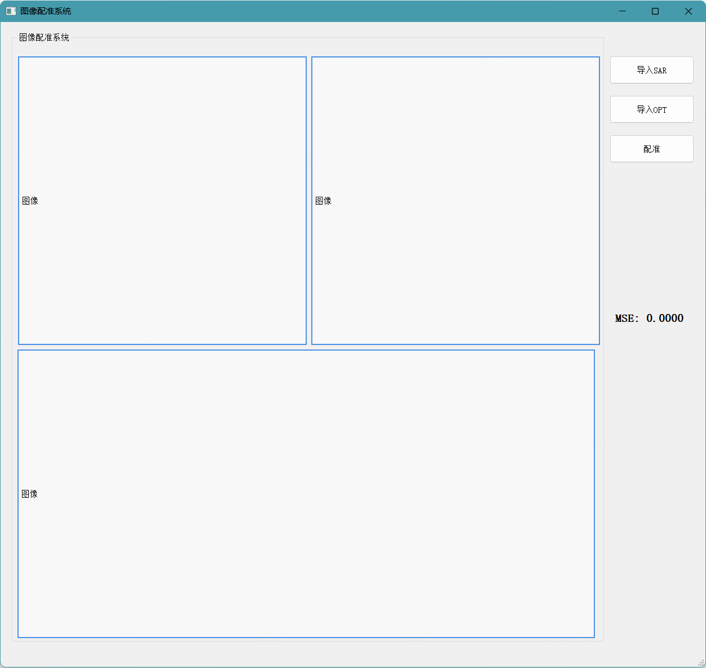

# SAR-Optical-Matching

[中文](./readme_zh.md)

A deep learning-based SAR-optical image registration system with training, evaluation, and a PyQt5-based visualization GUI.

## Environment Setup

```bash
conda create -n image_reg python=3.10
conda activate image_reg
pip3 install torch torchvision torchaudio --index-url https://download.pytorch.org/whl/cu118
pip install opencv-python scikit-image scipy tqdm pyqt5
pip install numpy==1.26.0
```

## Dataset

This project uses the OS (Optical-SAR) dataset, which contains paired SAR and optical images. Two resolution versions are provided, and each version is split into `train`, `val`, and `test` subsets:

- **OSdataset/512/**: 512×512 SAR-optical image pairs
- **OSdataset/256/**: 256×256 SAR-optical image pairs (downsampled from the 512 version)

## Training

1. Use `gen_sar_opt.py` to crop the 512×512 images in `OSdataset/512/` into 64×64 patches and save them to `OSdataset/patch/` for descriptor network training. Update the dataset paths in the script:
   ```python
   data_root = 'OSdataset/512/'
   patch_root = 'OSdataset/patch/'
   ```
2. After running the script, the index files `OS_train.txt`, `OS_val.txt`, and `OS_test.txt` will also be generated.
3. Update the related paths in `train.py`:
   ```python
   cfg.train_data = 'OS_train.txt'
   cfg.test_data = 'OS_val.txt'
   cfg.weights_dir = 'weights/'
   ```
4. Run `python train.py` to start training. The trained weights will be saved in the `weights/` directory.

## Evaluation

Evaluation uses the data in the `OS_crop/` directory, which is cropped from the original dataset. Each image pair is stored in an independent folder (such as `sar1/`) and contains:

- `sar{n}.png`: a 512×512 SAR image
- `opt{n}.png`: a 480×480 optical image (with a 32-pixel translation offset relative to the SAR image)
- `mat.txt`: the ground-truth transformation matrix describing the geometric relationship between the SAR and optical images

Use `eval.py` to evaluate on the test set. Update the model path and dataset path:

```python
eval_path = 'OS_crop'
model_base_path = f'{_model_base_path}/weights/'
```

Run the evaluation script and the output will be similar to: `mse: 1.8844 1.7377 2.6995 rate 0.9232`

## Visualization GUI

This project provides a PyQt5-based GUI for interactive SAR-optical image registration.

### Launch

```bash
python Ui_MainWindow.py
```

### Usage

1. **Import SAR image**: Click the **Import SAR** button on the right and choose a SAR image file (`png`, `jpg`, etc.).
2. **Import OPT image**: Click the **Import OPT** button on the right and choose an optical image file (`png`, `jpg`, etc.).
3. **Run registration**: Click the **Register** button on the right. The system will automatically perform feature extraction, feature matching, and homography estimation.
4. **View results**:
   - The SAR image is displayed at the upper left, and the optical image is displayed at the upper right.
   - The lower panel shows the registration result with matched keypoint pairs connected by green lines.
   - The right side displays the MSE (mean squared error), which is used to measure registration accuracy.

### Interface Description

- **SAR image area** (upper left): displays the imported SAR image
- **OPT image area** (upper right): displays the imported optical image
- **Registration result area** (bottom): displays the stitched SAR-optical result and the matching lines
- **MSE metric**: displays the mean squared error; a smaller value indicates better registration accuracy


